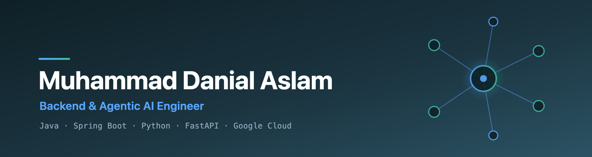
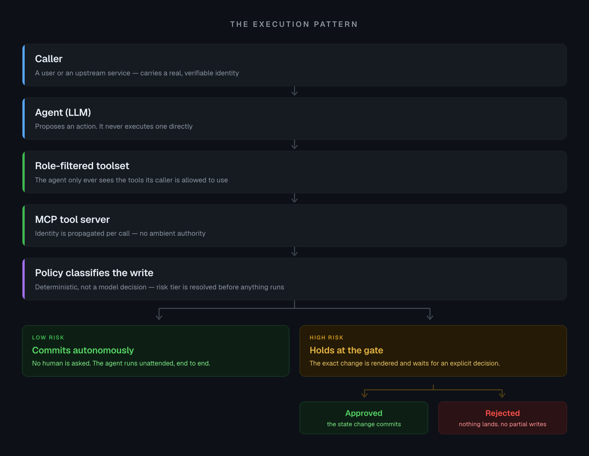

  

  

  
  
  
  

---

## 👨‍💻 &nbsp;About Me

Software engineer with three years of experience designing and delivering production backend systems and agentic AI applications on Google Cloud. Skilled in translating complex business requirements into production-grade software, working across Java/Spring Boot, Trillo Workbench, and Python/FastAPI to build REST APIs, async workflows, and third-party integrations.

---

## 🚀 &nbsp;What I'm Building

> Client platforms, so the repos are private — but this is the work.

### 🏦 &nbsp;Business-Acquisition Marketplace

A Spring Boot domain backend paired with a FastAPI service running **five LLM agents on Google ADK**. Stripe subscription billing, Plaid-backed verification, and three distinct roles — buyers, brokers, and admins — each seeing a different slice of the system.

### 🩺 &nbsp;Concierge Care Platform

Matches aging-adult clients with field staff through an **onboarding agent**, a **task-planning agent**, and a **pod matching engine**, wired into Gusto Embedded Payroll and Checkr background checks.

### 🚚 &nbsp;Multi-Tenant Drayage TMS

An **LLM pipeline that ingests delivery orders straight from email** — extracting and validating the structured data, running credit checks, and creating loads automatically across the order-to-delivery lifecycle.

---

## 🧩 &nbsp;How I Build Agents

**Models propose. Deterministic code executes.** The same pattern across all three platforms —
an agent can reason freely, but it can never reach past the boundary its caller was given, and a
deterministic policy — not the model — decides which writes commit on their own and which stop:

  

Underneath: **Vertex AI** and **Gemini** for inference, routed through **LiteLLM**; **BigQuery
vector search** backing RAG and semantic discovery; **GKE** for orchestration and **Redis** for
caching and rate limiting.

---

## 🛠️ &nbsp;Tech Stack

**Backend**

<table>
  <tr>
    <td align="center" width="205"> <b>Java</b></td>
    <td align="center" width="205"> <b>Spring Boot</b></td>
    <td align="center" width="205"> <b>Python</b></td>
    <td align="center" width="205"> <b>FastAPI</b></td>
  </tr>
</table>

**Cloud &amp; Infrastructure**

<table>
  <tr>
    <td align="center" width="136"> <b>Google Cloud</b></td>
    <td align="center" width="136"> <b>Kubernetes</b></td>
    <td align="center" width="136"> <b>Docker</b></td>
    <td align="center" width="136"> <b>Redis</b></td>
    <td align="center" width="136"> <b>PostgreSQL</b></td>
    <td align="center" width="136"> <b>MySQL</b></td>
  </tr>
</table>

**Agentic AI &amp; LLM**

<table>
  <tr>
    <td align="center" width="136"> <b>Google ADK</b></td>
    <td align="center" width="136"> <b>MCP</b></td>
    <td align="center" width="136"> <b>Gemini</b></td>
    <td align="center" width="136"> <b>Vertex AI</b></td>
    <td align="center" width="136"> <b>Claude</b></td>
    <td align="center" width="136"> <b>BigQuery</b></td>
  </tr>
</table>

**Tools**

<table>
  <tr>
    <td align="center" width="205"> <b>Git</b></td>
    <td align="center" width="205"> <b>Postman</b></td>
    <td align="center" width="205"> <b>IntelliJ</b></td>
    <td align="center" width="205"> <b>Jira</b></td>
  </tr>
</table>

## 🎓 &nbsp;Education &amp; Certifications

**BS Computer Science** — International Islamic University Islamabad

GOOGLE CLOUD CERTIFICATIONS

  
  
  
  
  

---

## 🔥 &nbsp;GitHub Stats

  

---

## 📬 &nbsp;Open To

  <b>Backend and agentic-AI engineering roles — open to remote, hybrid, or onsite.</b>

  
  

  

